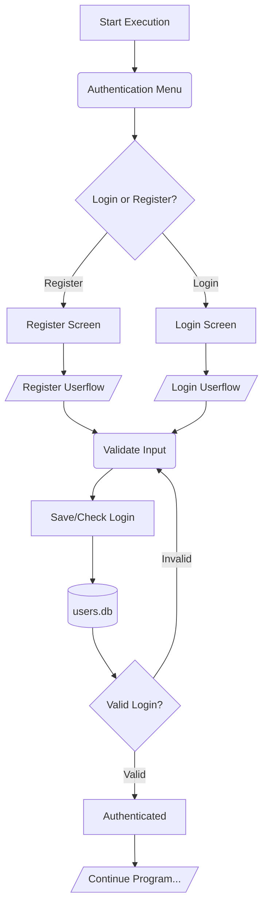

# py-vending-cli
A hack-together vending machine written in Python for use in the CLI. 

## Features
- User Authentication
- Balance stored in a database
- Hashed password storage
- Products database with stock
- Easily expandable

## Running
1. Install [Python3](https://www.python.org/)
2. Open a terminal in the root of the project
3. Run `python3 main.py`

## Database
The databases required will be automatically generated when the project is launched, to edit these, you can use a tool like [SQLiteBrowser](https://sqlitebrowser.org/)

## Authentication Flow

## License
This project is licensed under [MIT](LICENSE).
